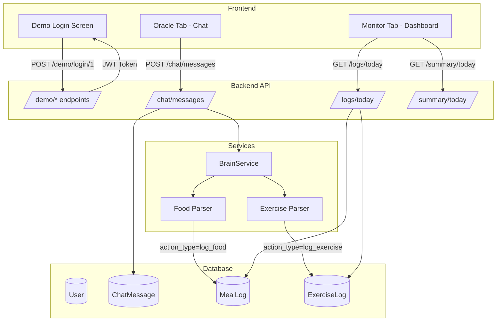

# Design Document: Slices 0-3 + Demo Mode

## Overview

This design covers the implementation of demo mode infrastructure, chat system with Brain service, and frontend integration. The goal is to create a demo-friendly fitness copilot where presenters can quickly switch between pre-configured demo users and showcase the conversational logging experience.

The system follows a "Brain → Body" architecture where:
- **Brain** (BrainService): Interprets natural language and decides actions
- **Body** (Logs/Database): Executes structured operations based on Brain decisions

## Architecture



## Components and Interfaces

### 1. Demo Mode Service

**Location:** `backend/app/services/demo.py`

```python
class DemoService:
    DEMO_USERS = [
        DemoUserConfig(
            number=1,
            email="demo1@test.com",
            name="Demo User 1 (Cutting)",
            weight_kg=85.0,
            height_cm=180,
            sex="male",
            age=30,
            goal_method=GoalMethod.STANDARD_CUT,
            activity_level=ActivityLevel.MODERATELY_ACTIVE,
        ),
        DemoUserConfig(
            number=2,
            email="demo2@test.com",
            name="Demo User 2 (Bulking)",
            weight_kg=70.0,
            height_cm=175,
            sex="male",
            age=25,
            goal_method=GoalMethod.MODERATE_GAIN,
            activity_level=ActivityLevel.VERY_ACTIVE,
        ),
        DemoUserConfig(
            number=3,
            email="demo3@test.com",
            name="Demo User 3 (Maintenance)",
            weight_kg=60.0,
            height_cm=165,
            sex="female",
            age=28,
            goal_method=GoalMethod.MAINTENANCE,
            activity_level=ActivityLevel.LIGHTLY_ACTIVE,
        ),
    ]
    
    def seed_demo_users(session: Session) -> None: ...
    def get_demo_users() -> list[DemoUserPublic]: ...
    def get_demo_token(user_number: int) -> Token: ...
```

### 2. Demo Mode API

**Location:** `backend/app/api/routes/demo.py`

| Endpoint | Method | Description |
|----------|--------|-------------|
| `/api/v1/demo/users` | GET | List available personas (cut, bulk, maintain) |
| `/api/v1/demo/login/{persona}` | POST | Create user if needed, return JWT token |

Only registered when `ENVIRONMENT == "local"`.

**Demo Login Flow:**

```python
@router.post("/login/{persona}")
def demo_login(persona: str, session: SessionDep) -> Token:
    """Create demo user if needed, return JWT token."""
    if persona not in PERSONAS:
        raise HTTPException(404, "Unknown persona")
    
    config = PERSONAS[persona]
    email = f"demo-{persona}@test.com"
    
    # Get or create user
    user = session.exec(select(User).where(User.email == email)).first()
    if not user:
        user = User(
            email=email,
            hashed_password=get_password_hash("demo1234"),
            **config,
            onboarding_complete=False,  # KEY: Forces onboarding screen
        )
        session.add(user)
        session.commit()
    
    # Return JWT token (same as normal login)
    return Token(access_token=create_access_token(user.id))
```

**Key Design Decision:** Demo users have `onboarding_complete=False` so the frontend shows the onboarding screen with pre-filled data. This demonstrates the full user journey.

### 3. Frontend Auth Flow

```
DemoLogin → POST /demo/login/cut → Token
         → GET /profile/me → { onboarding_complete: false, weight: 85, ... }
         → Render Onboarding (pre-filled!)
         → User clicks "Start Journey"
         → PUT /profile/me { onboarding_complete: true }
         → Render Dashboard
```

### 4. Brain Service

**Location:** `backend/app/services/brain.py`

**Parsing Strategy: Simple Keywords + LLM Fallback (No Regex)**

The BrainService uses a two-tier approach:
1. **Tier 1 - Simple keyword matching**: Fast, deterministic, works offline
2. **Tier 2 - LLM extraction**: For unknown foods or complex exercise descriptions

```python
from app.llm import get_llm_provider

@dataclass
class BrainResponse:
    content: str  # Assistant message text
    action_type: ChatActionType  # log_food, log_exercise, none
    action_data: dict | None  # Structured data for the action

class BrainService:
    # Food database with macros (simple keyword matching)
    FOOD_DB: dict[str, FoodMacros] = {
        "banana": FoodMacros(calories=105, protein=1.3, carbs=27, fat=0.4),
        "chicken": FoodMacros(calories=165, protein=31, carbs=0, fat=3.6),
        # ... 8 more foods
    }
    
    # Exercise mappings (simple keyword matching)
    EXERCISE_MAP: dict[str, str] = {
        "bench": "Bench Press",
        "squat": "Barbell Squat",
        # ... more exercises
    }
    
    def __init__(self):
        self.llm = get_llm_provider()  # None if LLM_ENABLED=False
    
    def _parse_food(self, content: str) -> BrainResponse | None:
        """Simple keyword matching - no regex."""
        lower = content.lower()
        
        # Tier 1: Check known foods with simple `in` check
        for food_name, macros in self.FOOD_DB.items():
            if food_name in lower:
                return BrainResponse(
                    content=f"Logged {food_name}: {macros.calories} kcal",
                    action_type=ChatActionType.LOG_FOOD,
                    action_data={"food": food_name, **macros.__dict__}
                )
        
        # Tier 2: Try LLM for unknown foods (if enabled)
        if self.llm:
            result = await self.llm.extract_json(FOOD_EXTRACTION_PROMPT.format(content=content))
            if result:
                return BrainResponse(...)
        
        return None  # Fall through to general response
    
    def _parse_exercise(self, content: str) -> BrainResponse | None:
        """Simple keyword matching + LLM for sets/reps extraction."""
        lower = content.lower()
        
        # Tier 1: Find exercise name
        exercise_name = None
        for keyword, name in self.EXERCISE_MAP.items():
            if keyword in lower:
                exercise_name = name
                break
        
        if not exercise_name:
            return None
        
        # Tier 2: Extract sets/reps/weight via LLM (or use defaults)
        sets, reps, weight = 3, 10, 0  # Defaults
        if self.llm:
            result = await self.llm.extract_json(EXERCISE_EXTRACTION_PROMPT.format(content=content))
            if result:
                sets = result.get("sets", 3)
                reps = result.get("reps", 10)
                weight = result.get("weight", 0)
        
        return BrainResponse(
            content=f"Logged {exercise_name}: {sets}x{reps} @ {weight}kg",
            action_type=ChatActionType.LOG_EXERCISE,
            action_data={"exercise": exercise_name, "sets": sets, "reps": reps, "weight_kg": weight}
        )
```

**Why this approach:**
- **No regex**: Simple `if "banana" in content.lower()` is faster to write and debug
- **LLM integration**: Uses existing `app.llm.google.GoogleLLMProvider` for complex cases
- **Graceful degradation**: Works without LLM (uses defaults), better with LLM

### 4. Chat Message Model

**Location:** `backend/app/models.py`

```python
class ChatMessageRole(str, Enum):
    USER = "user"
    ASSISTANT = "assistant"

class ChatActionType(str, Enum):
    LOG_FOOD = "log_food"
    LOG_EXERCISE = "log_exercise"
    NONE = "none"

class ChatMessage(SQLModel, table=True):
    __tablename__ = "chat_message"
    id: uuid.UUID = Field(default_factory=uuid.uuid4, primary_key=True)
    user_id: uuid.UUID = Field(foreign_key="user.id", index=True, ondelete="CASCADE")
    role: ChatMessageRole
    content: str = Field(max_length=2000)
    action_type: ChatActionType = Field(default=ChatActionType.NONE)
    action_data: dict | None = Field(default=None, sa_column=Column(JSON))
    created_at: datetime = Field(default_factory=datetime.utcnow, index=True)
```

### 5. Chat API Routes

**Location:** `backend/app/api/routes/chat.py`

| Endpoint | Method | Description |
|----------|--------|-------------|
| `/api/v1/chat/messages` | GET | Get chat history (limit param, default 50) |
| `/api/v1/chat/messages` | POST | Send message, get Brain response |

**POST /chat/messages Flow:**
1. Save user message to ChatMessage table
2. Call BrainService.process_message(content)
3. If action_type == LOG_FOOD: create MealLog
4. If action_type == LOG_EXERCISE: create ExerciseLog
5. Save assistant message to ChatMessage table
6. Return ChatMessagePublic with action_type and action_data

### 6. Frontend Demo Mode

**Location:** `frontend/src/hooks/useDemoMode.ts`

```typescript
interface DemoUser {
  number: number;
  email: string;
  name: string;
  description: string;
}

// Store selected demo user number (no token needed!)
export function useDemoMode() {
  const [demoUserNumber, setDemoUserNumber] = useState<number | null>(null);
  const [demoUsers, setDemoUsers] = useState<DemoUser[]>([]);
  
  // Check if demo mode is available (local env)
  const isDemoAvailable = useQuery({
    queryKey: ['demo', 'available'],
    queryFn: () => DemoService.getUsers().then(() => true).catch(() => false),
  });
  
  // Select a demo user (just stores the number, no token!)
  const selectDemoUser = (number: number) => {
    setDemoUserNumber(number);
    localStorage.setItem('demoUserNumber', String(number));
  };
  
  return {
    isDemoAvailable: isDemoAvailable.data,
    demoUsers,
    demoUserNumber,
    selectDemoUser,
    clearDemoUser: () => setDemoUserNumber(null),
  };
}
```

**Location:** `frontend/src/components/DemoLogin.tsx`

```typescript
function DemoLogin() {
  const { demoUsers, selectDemoUser } = useDemoMode();
  
  // Display 3 demo user cards
  // On click: selectDemoUser(number) → redirect to app
  // NO TOKEN MANAGEMENT - just store the user number
}
```

**Frontend Auth Hook:**

```typescript
// frontend/src/hooks/useAuth.ts
export function useAuth() {
  const [token, setToken] = useState<string | null>(localStorage.getItem('token'));
  
  const loginDemo = async (persona: 'cut' | 'bulk' | 'maintain') => {
    const response = await DemoService.login(persona);
    localStorage.setItem('token', response.access_token);
    OpenAPI.TOKEN = response.access_token;
    setToken(response.access_token);
  };
  
  const logout = () => {
    localStorage.removeItem('token');
    OpenAPI.TOKEN = undefined;
    setToken(null);
  };
  
  return { token, isAuthenticated: !!token, loginDemo, logout };
}
```

**FitnessApp Guard:**

```typescript
// frontend/src/components/FitnessApp.tsx
function FitnessApp() {
  const { isAuthenticated } = useAuth();
  const { data: profile, isLoading } = useProfile();
  
  if (!isAuthenticated) return <DemoLogin />;
  if (isLoading) return <FullScreenLoader />;
  if (!profile.onboardingComplete) return <Onboarding />;
  return <Dashboard />;
}
```

### 7. Frontend Chat Hook

**Location:** `frontend/src/hooks/useChat.ts`

```typescript
export function useChat() {
  const queryClient = useQueryClient();
  
  const messagesQuery = useQuery({
    queryKey: ['chat', 'messages'],
    queryFn: () => ChatService.getMessages(),
  });
  
  const sendMutation = useMutation({
    mutationFn: (content: string) => ChatService.sendMessage({ content }),
    onSuccess: (response) => {
      // Append to cache
      // If action_type is log_*, invalidate logs and summary
    },
  });
  
  return {
    messages: messagesQuery.data,
    isLoading: messagesQuery.isLoading,
    sendMessage: sendMutation.mutate,
    isSending: sendMutation.isPending,
  };
}
```

## Data Models

### ChatMessage Table

| Column | Type | Constraints |
|--------|------|-------------|
| id | UUID | PK |
| user_id | UUID | FK → user.id, INDEX, CASCADE DELETE |
| role | ENUM | 'user' or 'assistant' |
| content | VARCHAR(2000) | NOT NULL |
| action_type | ENUM | 'log_food', 'log_exercise', 'none' |
| action_data | JSON | NULLABLE |
| created_at | TIMESTAMP | INDEX, DEFAULT NOW() |

### Food Database (In-Memory)

| Food | Calories | Protein (g) | Carbs (g) | Fat (g) |
|------|----------|-------------|-----------|---------|
| banana | 105 | 1.3 | 27 | 0.4 |
| chicken | 165 | 31 | 0 | 3.6 |
| rice | 206 | 4.3 | 45 | 0.4 |
| eggs | 155 | 13 | 1.1 | 11 |
| oats | 150 | 5 | 27 | 3 |
| salmon | 208 | 20 | 0 | 13 |
| broccoli | 55 | 3.7 | 11 | 0.6 |
| apple | 95 | 0.5 | 25 | 0.3 |
| bread | 79 | 2.7 | 15 | 1 |
| milk | 149 | 8 | 12 | 8 |

### Exercise Mappings (In-Memory)

| Keyword | Exercise Name |
|---------|---------------|
| bench | Bench Press |
| squat | Barbell Squat |
| deadlift | Deadlift |
| press | Overhead Press |
| row | Barbell Row |
| curl | Bicep Curl |
| pullup | Pull-up |
| dip | Dips |

## Correctness Properties

*A property is a characteristic or behavior that should hold true across all valid executions of a system-essentially, a formal statement about what the system should do. Properties serve as the bridge between human-readable specifications and machine-verifiable correctness guarantees.*

Based on the prework analysis, the following properties have been identified after eliminating redundancy:

### Property 1: Chat message integrity and tenant association
*For any* chat message created, the message SHALL have all required fields (id, user_id, role, content, action_type, created_at) populated, AND the user_id SHALL match the authenticated user who created it.
**Validates: Requirements 3.1, 3.2**

### Property 2: Tenant isolation for chat messages
*For any* user requesting chat history, the returned messages SHALL contain only messages where user_id matches the requesting user's id - no messages from other users SHALL ever be returned.
**Validates: Requirements 3.3**

### Property 3: Chat message ordering
*For any* sequence of chat messages returned by the API, the messages SHALL be ordered by created_at in ascending order (oldest first).
**Validates: Requirements 3.4**

### Property 4: Food keyword detection triggers parsing
*For any* message containing food keywords (ate, eaten, had, breakfast, lunch, dinner, snack), the Brain Service SHALL invoke the food parser before falling back to general response.
**Validates: Requirements 5.1**

### Property 5: Known food parsing produces correct action
*For any* message containing a known food name from FOOD_DB, the Brain Service SHALL return action_type=log_food with action_data containing the correct macro values from the database.
**Validates: Requirements 5.2**

### Property 6: Food logging creates record and confirms
*For any* successful food parse (action_type=log_food), a MealLog record SHALL be created with matching data, AND the assistant response SHALL contain the food name and calorie count.
**Validates: Requirements 5.3, 5.4**

### Property 7: Unknown food falls back gracefully
*For any* message mentioning food keywords but containing no known food name, the Brain Service SHALL return action_type=none without error.
**Validates: Requirements 5.5**

### Property 8: Exercise keyword detection triggers parsing
*For any* message containing exercise keywords (bench, squat, deadlift, press, row, curl, sets, reps, kg, lbs), the Brain Service SHALL invoke the exercise parser.
**Validates: Requirements 6.1**

### Property 9: Exercise parsing extracts or defaults values
*For any* exercise message, the Brain Service SHALL extract sets, reps, and weight if present, OR use defaults (3 sets, 10 reps, 0 kg) if not specified.
**Validates: Requirements 6.2, 6.3**

### Property 10: Exercise logging creates record and confirms
*For any* successful exercise parse (action_type=log_exercise), an ExerciseLog record SHALL be created, AND the assistant response SHALL contain the exercise name and logged values.
**Validates: Requirements 6.4, 6.5**

### Property 11: Non-matching messages get helpful response
*For any* message that does not match food or exercise patterns, the Brain Service SHALL return action_type=none with a response containing example commands.
**Validates: Requirements 7.1, 7.2, 7.3**

### Property 12: Chat logging updates summary consistently
*For any* item logged via chat (food or exercise), the item SHALL appear in GET /logs/today AND the GET /summary/today values SHALL reflect the addition.
**Validates: Requirements 10.1, 10.2, 10.3, 10.4**

## Error Handling

| Scenario | Response |
|----------|----------|
| Demo endpoint called in production | 404 Not Found |
| Invalid demo user number (not 1-3) | 404 Not Found |
| Chat message too long (>2000 chars) | 422 Validation Error |
| Unauthenticated chat request | 401 Unauthorized |
| Database error during log creation | 500 Internal Error (log still saved, action_data contains error) |

## Testing Strategy

### Dual Testing Approach

This feature uses both unit tests and property-based tests:

- **Unit tests**: Verify specific examples, edge cases, and integration points
- **Property-based tests**: Verify universal properties hold across all inputs

### Property-Based Testing

**Library:** `hypothesis` (Python)

**Configuration:** Minimum 100 iterations per property test

**Test file:** `backend/app/tests/unit/test_brain_properties.py`

Each property test MUST:
1. Be tagged with a comment referencing the property: `# Feature: slices-0-3, Property N: <description>`
2. Use hypothesis strategies to generate diverse inputs
3. Assert the property holds for all generated inputs

### Unit Tests

**Files:**
- `backend/app/tests/unit/test_brain.py` - BrainService unit tests
- `backend/app/tests/unit/test_demo.py` - Demo service unit tests

### Acceptance Tests

**Files:**
- `backend/app/tests/acceptance/api/test_chat.py` - Chat endpoint tests
- `backend/app/tests/acceptance/api/test_demo.py` - Demo endpoint tests

### Test Scenarios

| Test | Type | Description |
|------|------|-------------|
| Food parsing - banana | Unit | "I ate a banana" → LOG_FOOD |
| Food parsing - unknown | Unit | "I ate a unicorn" → NONE |
| Exercise parsing - full | Unit | "3 sets of bench at 60kg" → LOG_EXERCISE |
| Exercise parsing - minimal | Unit | "did squats" → LOG_EXERCISE with defaults |
| General response | Unit | "hello" → NONE with suggestions |
| Demo users seeded | Acceptance | After init, 3 demo users exist |
| Demo login returns token | Acceptance | POST /demo/login/1 → valid JWT |
| Chat creates logs | Acceptance | POST /chat with food → MealLog created |
| Tenant isolation | Acceptance | User A can't see User B's messages |
| Message ordering | Property | Messages always sorted by created_at |
| Food keyword routing | Property | Food keywords always trigger parser |
