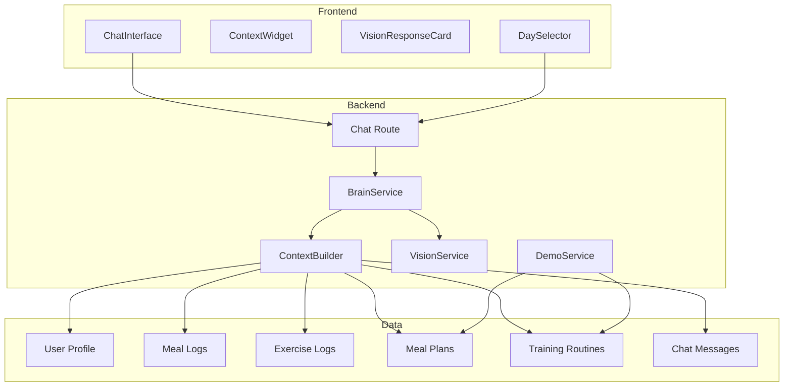

# Design Document: Smart Assistant

## Overview

The Smart Assistant feature enhances the Fitness Copilot to become a context-aware personal fitness coach. It builds rich context from user profile, daily progress, weekly meal plans, and conversation history to provide personalized responses. The feature also improves the vision UX with explicit tracking confirmation, introduces realistic demo data with weekly plans, and enables day simulation for testing.

## Architecture



## Components and Interfaces

### 1. Enhanced ContextBuilder

The ContextBuilder is responsible for assembling all relevant user data into a structured context object for LLM prompts.

```python
@dataclass
class UserContext:
    # Profile
    user_id: UUID
    weight_kg: float
    height_cm: int
    goal_method: GoalMethod
    activity_level: ActivityLevel
    sex: str
    
    # Daily Progress (from REAL logs)
    calories_consumed: int
    calories_target: int  # From simulated day's plan
    protein_consumed: float
    protein_target: float  # From simulated day's plan
    workouts_completed: int
    
    # Simulated Day's Plan (targets)
    scheduled_meals: list[dict]  # From weekly meal plan for simulated_day
    scheduled_exercises: list[dict]  # From training routine for simulated_day
    allowed_exercises: list[str]
    
    # Conversation (TEXT ONLY - no attachments)
    chat_history: list[dict]  # Last 10 messages, content only
    
    # Simulation
    simulated_day: int  # 0-6 (Monday-Sunday)
```

**Critical: Chat History Filtering**

When building `chat_history`, the ContextBuilder MUST:
1. Exclude `attachment_url` field (may contain base64 data)
2. Exclude `attachment_type` field
3. Only include `role` and `content` (text) fields
4. Limit to last 10 messages

This prevents token bloat from image data in conversation history.

### 2. Vision Response with Tracking Confirmation

Vision responses use a "propose" action type instead of direct logging:

```python
class ChatActionType(str, Enum):
    LOG_FOOD = "log_food"
    LOG_EXERCISE = "log_exercise"
    PROPOSE_FOOD = "propose_food"      # New: preview before tracking
    PROPOSE_EXERCISE = "propose_exercise"  # New: preview before tracking
    RESET = "reset"
    NONE = "none"
```

The BrainService returns `PROPOSE_*` for image analysis, storing full data in `action_data`:
- Frontend shows "Add to Track" button
- User clicks → `POST /chat/{message_id}/confirm` → creates log, updates `is_tracked`
- Form tips stored in `action_data.hidden_context.form_cues`
- "Show Tips" button reads from stored data, injects local message

### 3. Quick Add Configuration

```python
QUICK_ADD_MEALS = [
    {
        "emoji": "🥗",
        "name": "Grilled Chicken Salad",
        "calories": 450,
        "protein_g": 42,
        "carbs_g": 18,
        "fat_g": 22,
    },
    {
        "emoji": "🥣",
        "name": "Oatmeal with Berries",
        "calories": 320,
        "protein_g": 12,
        "carbs_g": 52,
        "fat_g": 8,
    },
    {
        "emoji": "🍳",
        "name": "Eggs & Avocado Toast",
        "calories": 480,
        "protein_g": 22,
        "carbs_g": 35,
        "fat_g": 28,
    },
    {
        "emoji": "🍗",
        "name": "Rice & Grilled Chicken",
        "calories": 550,
        "protein_g": 45,
        "carbs_g": 55,
        "fat_g": 12,
    },
]
```

### 4. Demo Persona Configuration

```python
DEMO_PERSONAS = {
    "cut": {
        "name": "Alex (Cutting)",
        "description": "6-day PPL split, calorie deficit",
        "weight_kg": 85,
        "height_cm": 180,
        "goal_method": GoalMethod.STANDARD_CUT,
        "activity_level": ActivityLevel.VERY_ACTIVE,
        "training_days": 6,  # Push/Pull/Legs x2
        "calorie_target": 1800,
    },
    "bulk": {
        "name": "Jordan (Bulking)",
        "description": "4-day Upper/Lower, calorie surplus",
        "weight_kg": 75,
        "height_cm": 178,
        "goal_method": GoalMethod.MODERATE_GAIN,
        "activity_level": ActivityLevel.VERY_ACTIVE,
        "training_days": 4,  # Upper/Lower x2
        "calorie_target": 3200,
    },
    "maintain": {
        "name": "Sam (Maintenance)",
        "description": "3-day Full Body, maintenance calories",
        "weight_kg": 65,
        "height_cm": 168,
        "goal_method": GoalMethod.MAINTENANCE,
        "activity_level": ActivityLevel.MODERATELY_ACTIVE,
        "training_days": 3,  # Full Body x3
        "calorie_target": 2200,
    },
}
```

### 5. Simulated Day Management

**Key Principle: Simulated Day affects TARGETS, not LOGS**

```python
class SimulatedDayService:
    """Manages the simulated current day for demo purposes."""
    
    def get_simulated_day(self, user_id: UUID) -> int:
        """Get the simulated day (0-6) for a user."""
        pass
    
    def set_simulated_day(self, user_id: UUID, day: int) -> None:
        """Set the simulated day (0-6) for a user."""
        pass
    
    def get_day_name(self, day: int) -> str:
        """Convert day number to name (Monday-Sunday)."""
        pass
```

**Data Flow:**
- `MealLog.logged_at` → Always REAL UTC timestamp
- `ExerciseLog.logged_at` → Always REAL UTC timestamp
- `GET /plans/meal/today` → Uses `simulated_day` to fetch targets
- `GET /plans/training/today` → Uses `simulated_day` to fetch routine
- `GET /summary/today` → Real logs vs simulated day targets

This allows users to test "What if I eat this on a High Carb Day (Friday)?" without corrupting the database with fake dates.

## Data Models

### User Model Extension

Add `simulated_day` field to User model:

```python
class User(UserBase, table=True):
    # ... existing fields ...
    simulated_day: int = Field(default=0, ge=0, le=6)  # 0=Monday, 6=Sunday
```

### Vision Analysis Storage (No New Table)

Vision analysis results are stored in the existing `ChatMessage.action_data` JSON column:

```python
# ChatMessage.action_data structure for vision responses
{
    "action_type": "propose_food",  # or "propose_exercise"
    "is_tracked": False,
    
    # For food
    "meal_name": "Grilled Chicken Salad",
    "calories": 450,
    "protein_g": 42,
    "carbs_g": 18,
    "fat_g": 22,
    
    # For exercise
    "exercise_name": "Leg Press",
    "suggested_sets": 3,
    "suggested_reps": 12,
    "suggested_weight_kg": 100,
    
    # Hidden context (not shown initially)
    "hidden_context": {
        "form_cues": ["Keep back flat", "Don't lock knees"],
    }
}
```

This approach:
- Requires no database schema changes
- Uses existing ChatMessage table
- Stores hidden form_cues for on-demand retrieval
- Tracks confirmation state via `is_tracked` flag

### Weekly Meal Plan Structure

Meal plans are stored per user, per day of week:

```python
class MealPlan(MealPlanBase, table=True):
    # ... existing fields ...
    day_of_week: int  # 0-6 (Monday-Sunday)
    meal_type: str  # "breakfast", "lunch", "dinner", "snack"
```

## Correctness Properties

*A property is a characteristic or behavior that should hold true across all valid executions of a system-essentially, a formal statement about what the system should do. Properties serve as the bridge between human-readable specifications and machine-verifiable correctness guarantees.*

### Property 1: Tenant Isolation in Context Building

*For any* two users A and B, when building context for user A, the resulting context SHALL contain zero data items (chat messages, meal logs, exercise logs, profile data) belonging to user B.

**Validates: Requirements 1.5, 8.1, 8.2, 8.3, 8.4, 8.5**

### Property 2: Context Completeness and Safety

*For any* user with profile data, meal logs, exercise logs, and chat messages, the built context SHALL:
- Include user profile fields (weight, height, goal, activity level)
- Include current day's logs (real timestamps)
- Include simulated day's meal plan targets
- Include the last N chat messages (where N ≤ 10) with TEXT CONTENT ONLY
- EXCLUDE attachment_url and base64 image data from chat history

**Validates: Requirements 1.1, 1.2, 1.3, 1.4, 1.7**

### Property 3: Vision Analysis Preview Mode

*For any* image upload, the response SHALL have `action_type` of `PROPOSE_FOOD` or `PROPOSE_EXERCISE` (not `LOG_*`), and `action_data.is_tracked` SHALL be `False`.

**Validates: Requirements 2.1, 2.2, 2.3**

### Property 4: Tracking Confirmation Creates Log

*For any* ChatMessage with `action_type=PROPOSE_*` and `is_tracked=False`, calling `POST /chat/{message_id}/confirm` SHALL create exactly one corresponding log entry and set `action_data.is_tracked=True`.

**Validates: Requirements 2.4, 2.7**

### Property 5: Form Tips Storage

*For any* gym equipment analysis, the `action_data.hidden_context.form_cues` SHALL contain at least one form tip, and this data SHALL be retrievable from the ChatMessage without a new LLM call.

**Validates: Requirements 2.5, 2.6**

### Property 6: Quick Add Macro Validity

*For any* quick add meal option, the macro values SHALL satisfy: calories > 200, protein_g > 5, and the meal name SHALL contain at least two words (indicating a complete dish).

**Validates: Requirements 3.1, 3.2, 3.3**

### Property 7: Weekly Meal Plan Completeness

*For any* demo user, after creation, there SHALL exist meal plan entries for all 7 days (0-6), with at least 3 meals per day.

**Validates: Requirements 4.1, 5.4**

### Property 8: Simulated Day Affects Targets Only

*For any* user with a simulated day D:
- Meal plan queries SHALL return data where `day_of_week == D`
- Training routine queries SHALL return data where `day_of_week == D`
- Log entries SHALL always use real UTC timestamps (not simulated day)
- Summary SHALL compare real logs against simulated day's targets

**Validates: Requirements 4.2, 4.3, 4.4, 6.2, 6.3, 6.4, 6.5**

### Property 9: Demo Persona Training Days

*For any* demo persona creation, the assigned training program SHALL have exactly the specified number of training days: "cut" → 6 days, "bulk" → 4 days, "maintain" → 3 days.

**Validates: Requirements 5.1, 5.2, 5.3**

### Property 10: Meal Logging Feedback

*For any* meal log action, the assistant response SHALL include at least one reference to daily progress (calories consumed, calories remaining, or percentage of target).

**Validates: Requirements 7.2**

### Property 11: Exercise Logging Feedback

*For any* exercise log action where the user has a training plan, the assistant response SHALL reference the training plan or workout progress.

**Validates: Requirements 7.3**

### Property 12: Chat History Token Safety

*For any* chat history included in LLM context, the total character count of all message contents SHALL be less than 10,000 characters, and NO message SHALL contain base64 encoded data or attachment URLs.

**Validates: Requirements 1.4, 1.7**

## Error Handling

1. **Missing Context Data**: If user profile is incomplete, use sensible defaults and note in response
2. **Vision Analysis Failure**: Return helpful message asking user to describe the item
3. **Tracking Already Confirmed**: If message `is_tracked=True`, return "Already tracked" message
4. **Message Not Found**: If message_id doesn't exist, return 404
5. **Invalid Simulated Day**: Clamp to valid range (0-6)
6. **LLM Timeout**: Fall back to keyword-based responses with context summary
7. **Chat History Too Long**: Truncate to last 10 messages, exclude attachments

## Testing Strategy

### Dual Testing Approach

This feature requires both unit tests and property-based tests:

- **Unit tests**: Verify specific examples, edge cases, and integration points
- **Property-based tests**: Verify universal properties across all valid inputs using Hypothesis

### Property-Based Testing

Use **Hypothesis** library for Python property-based testing.

Each property test SHALL:
1. Run a minimum of 100 iterations
2. Be tagged with a comment referencing the correctness property
3. Use smart generators that constrain to valid input spaces

### Test Categories

1. **Context Building Tests**
   - Verify tenant isolation with multiple users
   - Verify all context fields are populated
   - Verify chat history limit (max 10)

2. **Vision UX Tests**
   - Verify preview mode (is_tracked=False)
   - Verify tracking confirmation creates logs
   - Verify form tips caching

3. **Demo Data Tests**
   - Verify weekly meal plan creation
   - Verify persona-specific training days
   - Verify simulated day filtering

4. **Response Quality Tests**
   - Verify meal logging includes progress feedback
   - Verify exercise logging references training plan
