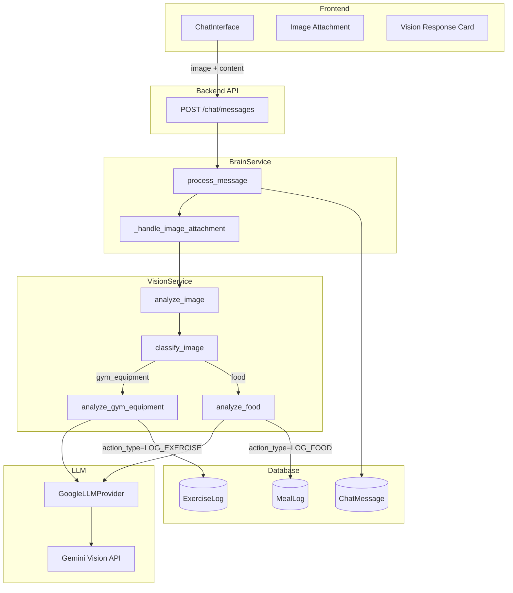

# Design Document: Vision (Slices 4 & 6)

## Overview

This feature adds image processing to the Fitness Copilot, enabling users to send photos of gym equipment or food and receive intelligent analysis with automatic logging. The system uses Google Gemini's vision capabilities to:

1. **Classify images** as gym equipment, food, or unknown
2. **Analyze gym equipment** to identify exercises and provide form guidance
3. **Analyze food** to estimate nutritional content

The vision system integrates with the existing BrainService, replacing hardcoded image responses with AI-powered analysis while maintaining graceful fallback when LLM is disabled.

## Architecture



## Components and Interfaces

### 1. VisionService

**Location:** `backend/app/services/vision.py`

```python
from dataclasses import dataclass
from enum import Enum

class ImageCategory(str, Enum):
    GYM_EQUIPMENT = "gym_equipment"
    FOOD = "food"
    UNKNOWN = "unknown"

@dataclass
class GymEquipmentAnalysis:
    exercise_name: str
    form_cues: list[str]  # 2-3 cues
    suggested_sets: int
    suggested_reps: int
    suggested_weight_kg: float
    in_todays_plan: bool = False  # NEW: Whether exercise is in today's plan
    goal_specific_advice: str = ""  # NEW: Advice based on user's goal

@dataclass
class FoodAnalysis:
    meal_name: str
    calories: int
    protein_g: float
    carbs_g: float
    fat_g: float
    goal_specific_advice: str = ""  # NEW: Advice based on user's goal

@dataclass
class VisionResult:
    category: ImageCategory
    gym_analysis: GymEquipmentAnalysis | None = None
    food_analysis: FoodAnalysis | None = None
    error_message: str | None = None

class VisionService:
    """Service for analyzing images using Google Gemini Vision."""
    
    def __init__(self):
        self._llm = None
    
    @property
    def llm(self):
        """Lazy load LLM provider."""
        if self._llm is None:
            from app.llm import get_llm_provider
            self._llm = get_llm_provider()
        return self._llm
    
    async def analyze_image(
        self, 
        image_url: str | None = None,
        image_base64: str | None = None,
        context: UserContext | None = None,  # NEW: Accept context
    ) -> VisionResult:
        """
        Analyze an image and return classification + analysis.
        
        Args:
            image_url: URL to the image (e.g., from demo-images/)
            image_base64: Base64-encoded image data
            context: User context for personalized prompts
            
        Returns:
            VisionResult with category and appropriate analysis
        """
        if not self.llm:
            return VisionResult(
                category=ImageCategory.UNKNOWN,
                error_message="I can see you sent an image! For now, please describe what you're showing me and I'll help log it."
            )
        
        # Step 1: Classify the image
        category = await self._classify_image(image_url, image_base64)
        
        # Step 2: Route to appropriate analyzer WITH CONTEXT
        if category == ImageCategory.GYM_EQUIPMENT:
            gym_analysis = await self._analyze_gym_equipment(image_url, image_base64, context)
            return VisionResult(category=category, gym_analysis=gym_analysis)
        
        if category == ImageCategory.FOOD:
            food_analysis = await self._analyze_food(image_url, image_base64, context)
            return VisionResult(category=category, food_analysis=food_analysis)
        
        return VisionResult(
            category=ImageCategory.UNKNOWN,
            error_message="I'm not sure what this image shows. Could you describe it? I can help log food or exercises."
        )
    
    async def _classify_image(
        self,
        image_url: str | None,
        image_base64: str | None,
    ) -> ImageCategory:
        """Classify image as gym_equipment, food, or unknown."""
        prompt = """Analyze this image and classify it into exactly one category:
        - "gym_equipment": gym machines, weights, exercise equipment
        - "food": meals, snacks, ingredients, drinks
        - "unknown": anything else
        
        Respond with ONLY the category name, nothing else."""
        
        result = await self.llm.analyze_image(prompt, image_url, image_base64)
        
        if "gym" in result.lower() or "equipment" in result.lower():
            return ImageCategory.GYM_EQUIPMENT
        if "food" in result.lower():
            return ImageCategory.FOOD
        return ImageCategory.UNKNOWN
    
    def _build_system_context(self, context: UserContext | None) -> str:
        """Build system context string for prompts."""
        if not context:
            return "No user context available."
        
        # Format scheduled exercises
        exercises_formatted = "\n".join(
            f"- {e['name']}: {e['sets']}x{e['reps']} @ {e['target_weight']}kg"
            for e in context.scheduled_exercises
        ) or "No exercises scheduled today."
        
        # Format chat history
        history_formatted = "\n".join(
            f"{m['role'].upper()}: {m['content']}"
            for m in context.chat_history[-5:]
        ) or "No recent messages."
        
        return f"""USER PROFILE:
- Goal: {context.goal_method}
- Weight: {context.weight_kg}kg
- Sex: {context.sex}

TODAY'S PROGRESS:
- Calories: {context.calories_consumed} / {context.calories_target} kcal
- Protein: {context.protein_consumed}g / {context.protein_target}g
- Workouts completed: {context.workouts_completed}

TODAY'S TRAINING PLAN:
{exercises_formatted}

ALLOWED EXERCISES:
{', '.join(context.allowed_exercises) or 'Any exercise'}

RECENT CONVERSATION:
{history_formatted}"""

    async def _analyze_gym_equipment(
        self,
        image_url: str | None,
        image_base64: str | None,
        context: UserContext | None = None,
    ) -> GymEquipmentAnalysis:
        """Analyze gym equipment image for exercise details."""
        system_context = self._build_system_context(context)
        
        prompt = f"""Analyze this gym equipment image.

{system_context}

TASK: Identify the exercise and provide guidance.

RULES:
1. If this exercise is in TODAY'S TRAINING PLAN, use those exact sets/reps/weight
2. If not in the plan, suggest reasonable defaults based on the user's goal
3. ONLY use exercise names from the ALLOWED EXERCISES list
4. Provide form cues specific to the user's goal (strength vs hypertrophy)

Respond in JSON format ONLY (no markdown, no explanation):
{{"exercise_name": "Name from allowed list", "form_cues": ["Tip 1", "Tip 2"], "suggested_sets": 3, "suggested_reps": 10, "suggested_weight_kg": 0, "in_todays_plan": false, "goal_specific_advice": "Brief advice"}}"""
        
        result = await self.llm.extract_json_from_image(prompt, image_url, image_base64)
        
        if result:
            data = result[0] if isinstance(result, list) else result
            return GymEquipmentAnalysis(
                exercise_name=data.get("exercise_name", "Unknown Exercise"),
                form_cues=data.get("form_cues", ["Maintain proper form", "Control the movement"]),
                suggested_sets=data.get("suggested_sets", 3),
                suggested_reps=data.get("suggested_reps", 10),
                suggested_weight_kg=data.get("suggested_weight_kg", 0),
                in_todays_plan=data.get("in_todays_plan", False),
                goal_specific_advice=data.get("goal_specific_advice", ""),
            )
        
        # Fallback
        return GymEquipmentAnalysis(
            exercise_name="Unknown Exercise",
            form_cues=["Maintain proper form", "Control the movement"],
            suggested_sets=3,
            suggested_reps=10,
            suggested_weight_kg=0,
            in_todays_plan=False,
            goal_specific_advice="",
        )
    
    async def _analyze_food(
        self,
        image_url: str | None,
        image_base64: str | None,
        context: UserContext | None = None,
    ) -> FoodAnalysis:
        """Analyze food image for nutritional content."""
        system_context = self._build_system_context(context)
        
        prompt = f"""Analyze this food image.

{system_context}

TASK: Estimate the nutritional content of this meal.

RULES:
1. Consider the user's goal when giving advice:
   - CUTTING: Be conservative with estimates, warn about high-calorie items
   - BULKING: Celebrate protein and carbs, suggest additions if needed
   - MAINTENANCE: Provide balanced feedback
2. Reference today's progress in your advice
3. Be encouraging but honest

Respond in JSON format ONLY (no markdown, no explanation):
{{"meal_name": "Description", "calories": 500, "protein_g": 30, "carbs_g": 40, "fat_g": 20, "goal_specific_advice": "Brief advice based on goal and progress"}}"""
        
        result = await self.llm.extract_json_from_image(prompt, image_url, image_base64)
        
        if result:
            data = result[0] if isinstance(result, list) else result
            return FoodAnalysis(
                meal_name=data.get("meal_name", "Unknown Meal"),
                calories=data.get("calories", 300),
                protein_g=data.get("protein_g", 15),
                carbs_g=data.get("carbs_g", 30),
                fat_g=data.get("fat_g", 10),
                goal_specific_advice=data.get("goal_specific_advice", ""),
            )
        
        # Fallback
        return FoodAnalysis(
            meal_name="Unknown Meal",
            calories=300,
            protein_g=15,
            carbs_g=30,
            fat_g=10,
            goal_specific_advice="",
        )
```

### 2. GoogleLLMProvider Vision Extension

**Location:** `backend/app/llm/google.py` (extend existing)

```python
async def analyze_image(
    self,
    prompt: str,
    image_url: str | None = None,
    image_base64: str | None = None,
    timeout_s: float = 30.0,
) -> str | None:
    """Analyze an image with a text prompt using Gemini Vision."""
    try:
        # Build content parts
        parts = [prompt]
        
        if image_url:
            # For URLs, Gemini can fetch directly
            parts.append({"image_url": image_url})
        elif image_base64:
            # For base64, include inline
            parts.append({
                "inline_data": {
                    "mime_type": "image/jpeg",
                    "data": image_base64
                }
            })
        
        response = await asyncio.wait_for(
            self.model.generate_content_async(
                parts,
                generation_config=genai.types.GenerationConfig(temperature=0.3),
                safety_settings=self._get_safety_settings(),
            ),
            timeout=timeout_s,
        )
        return self._extract_text(response)
    except TimeoutError:
        logger.warning("Vision analysis timed out after %.1fs", timeout_s)
        return None
    except Exception as e:
        logger.error("Vision analysis error: %s", e)
        return None

async def extract_json_from_image(
    self,
    prompt: str,
    image_url: str | None = None,
    image_base64: str | None = None,
    timeout_s: float = 30.0,
) -> list[dict[str, Any]]:
    """Extract structured JSON from an image analysis."""
    # Similar to extract_json but with image input
    ...
```

### 3. Context Builder

**Location:** `backend/app/services/context.py`

The Context Builder gathers all relevant context before calling the LLM. This is crucial for the "Copilot" experience.

```python
from dataclasses import dataclass
from app.models import User, ChatMessage, TrainingRoutine, MealPlan

@dataclass
class UserContext:
    """All context needed for LLM prompts."""
    # User Profile
    user_id: str
    goal_method: str  # "standard_cut", "moderate_gain", "maintenance"
    weight_kg: float
    sex: str
    
    # Today's Progress
    calories_consumed: int
    calories_target: int
    protein_consumed: float
    protein_target: float
    workouts_completed: int
    
    # Today's Training Plan (from CSV/DB)
    scheduled_exercises: list[dict]  # [{"name": "Leg Press", "sets": 4, "reps": 10, "target_weight": 80}]
    allowed_exercises: list[str]  # ["Leg Press", "Squat", "Deadlift", ...]
    
    # Recent Chat History (last 5 messages)
    chat_history: list[dict]  # [{"role": "user", "content": "..."}, ...]

class ContextBuilder:
    """Builds context for LLM prompts."""
    
    def build_context(
        self,
        session: Session,
        user_id: uuid.UUID,
    ) -> UserContext:
        """Gather all context for a user."""
        user = session.get(User, user_id)
        
        # Get today's summary
        summary = get_today_summary(session, user_id)
        
        # Get today's training plan
        today_routine = get_today_routine(session, user_id)
        scheduled_exercises = [
            {"name": r.exercise_name, "sets": r.sets, "reps": r.reps, "target_weight": r.target_weight_kg}
            for r in today_routine
        ]
        
        # Get allowed exercises from all routines
        all_routines = get_all_routines(session, user_id)
        allowed_exercises = list(set(r.exercise_name for r in all_routines))
        
        # Get recent chat history
        recent_messages = get_chat_messages(session, user_id, limit=5)
        chat_history = [
            {"role": m.role.value, "content": m.content}
            for m in recent_messages
        ]
        
        return UserContext(
            user_id=str(user_id),
            goal_method=user.goal_method.value if user.goal_method else "maintenance",
            weight_kg=user.weight_kg or 70,
            sex=user.sex or "unknown",
            calories_consumed=summary.calories_consumed,
            calories_target=summary.calories_target,
            protein_consumed=summary.protein_consumed,
            protein_target=summary.protein_target,
            workouts_completed=summary.workouts_completed,
            scheduled_exercises=scheduled_exercises,
            allowed_exercises=allowed_exercises,
            chat_history=chat_history,
        )
```

### 4. System Prompt Template

**Location:** `backend/app/services/prompts.py`

```python
SYSTEM_PROMPT = """You are the Fitness Copilot, a friendly AI assistant that helps users track their fitness journey.

Your primary goal is to extract structured logs (Food/Exercise) from user messages and images.

RULES:
1. Always respond in a friendly, encouraging tone
2. For exercises, ONLY suggest exercises from the allowed list
3. For food, estimate macros conservatively
4. Consider the user's goal when giving advice
5. Reference today's progress when relevant

USER PROFILE:
- Goal: {goal_method}
- Weight: {weight_kg}kg
- Sex: {sex}

TODAY'S PROGRESS:
- Calories: {calories_consumed} / {calories_target} kcal
- Protein: {protein_consumed}g / {protein_target}g
- Workouts completed: {workouts_completed}

TODAY'S TRAINING PLAN:
{scheduled_exercises_formatted}

ALLOWED EXERCISES:
{allowed_exercises_list}

RECENT CONVERSATION:
{chat_history_formatted}
"""

GYM_ANALYSIS_PROMPT = """Analyze this gym equipment image.

{system_context}

TASK: Identify the exercise and provide guidance.

If this exercise is in TODAY'S TRAINING PLAN, use those exact sets/reps/weight.
If not in the plan, suggest reasonable defaults based on the user's goal.

Respond in JSON format:
{{
  "exercise_name": "Name from ALLOWED EXERCISES list",
  "form_cues": ["Tip 1", "Tip 2", "Tip 3"],
  "suggested_sets": 3,
  "suggested_reps": 10,
  "suggested_weight_kg": 0,
  "in_todays_plan": true,
  "goal_specific_advice": "Brief advice based on user's goal"
}}"""

FOOD_ANALYSIS_PROMPT = """Analyze this food image.

{system_context}

TASK: Estimate the nutritional content of this meal.

Consider the user's goal:
- If CUTTING: Be conservative with estimates, warn about high-calorie items
- If BULKING: Celebrate protein and carbs, suggest additions if needed
- If MAINTENANCE: Provide balanced feedback

Respond in JSON format:
{{
  "meal_name": "Description of the meal",
  "calories": 500,
  "protein_g": 30,
  "carbs_g": 40,
  "fat_g": 20,
  "goal_specific_advice": "Brief advice based on user's goal and today's progress"
}}"""
```

### 5. BrainService Integration with Context

**Location:** `backend/app/services/brain.py` (modify existing)

```python
from app.services.vision import VisionService, ImageCategory
from app.services.context import ContextBuilder, UserContext

class BrainService:
    def __init__(self, session: Session | None = None):
        self._llm = None
        self._vision = None
        self._context_builder = ContextBuilder()
        self._session = session
    
    @property
    def vision(self):
        """Lazy load Vision service."""
        if self._vision is None:
            self._vision = VisionService()
        return self._vision
    
    def _build_context(self, user_id: uuid.UUID) -> UserContext | None:
        """Build context for LLM prompts."""
        if not self._session:
            return None
        return self._context_builder.build_context(self._session, user_id)
    
    async def _handle_image_attachment(
        self,
        user_id: uuid.UUID,
        image_base64: str | None = None,
    ) -> BrainResponse:
        """Handle image attachment with vision analysis."""
        # Build context for the prompt
        context = self._build_context(user_id)
        
        # Analyze image with context
        result = await self.vision.analyze_image(
            image_base64=image_base64,
            context=context,  # Pass context to VisionService
        )
        
        if result.error_message:
            return BrainResponse(
                content=result.error_message,
                action_type=ChatActionType.NONE,
            )
        
        if result.category == ImageCategory.GYM_EQUIPMENT and result.gym_analysis:
            ga = result.gym_analysis
            cues_text = "\n".join(f"• {cue}" for cue in ga.form_cues)
            weight_str = f" @ {ga.suggested_weight_kg}kg" if ga.suggested_weight_kg > 0 else ""
            
            # Add goal-specific advice if available
            advice = f"\n\n💡 {ga.goal_specific_advice}" if ga.goal_specific_advice else ""
            plan_note = " (from today's plan)" if ga.in_todays_plan else ""
            
            return BrainResponse(
                content=f"🏋️ **{ga.exercise_name}**{plan_note}\n\n{cues_text}\n\n💪 Logged: {ga.suggested_sets}x{ga.suggested_reps}{weight_str}{advice}",
                action_type=ChatActionType.LOG_EXERCISE,
                action_data={
                    "exercise_name": ga.exercise_name,
                    "sets": ga.suggested_sets,
                    "reps": ga.suggested_reps,
                    "weight_kg": ga.suggested_weight_kg,
                    "form_cues": ga.form_cues,
                },
            )
        
        if result.category == ImageCategory.FOOD and result.food_analysis:
            fa = result.food_analysis
            
            # Add goal-specific advice and progress context
            advice = f"\n\n💡 {fa.goal_specific_advice}" if fa.goal_specific_advice else ""
            
            return BrainResponse(
                content=f"🍽️ **{fa.meal_name}**\n\n📊 {fa.calories} kcal | {fa.protein_g}g protein | {fa.carbs_g}g carbs | {fa.fat_g}g fat\n\n✅ Logged to today's meals!{advice}",
                action_type=ChatActionType.LOG_FOOD,
                action_data={
                    "meal_name": fa.meal_name,
                    "meal_type": "snack",
                    "calories": fa.calories,
                    "protein_g": fa.protein_g,
                    "carbs_g": fa.carbs_g,
                    "fat_g": fa.fat_g,
                },
            )
        
        return BrainResponse(
            content=result.error_message or "I couldn't analyze this image. Please describe what you're showing me.",
            action_type=ChatActionType.NONE,
        )
```

### 4. Image Upload Strategy

**Problem:** The current `attachment_url` field is `String(500)`, but base64 images can be 500KB+.

**Solution:** Add a dedicated image upload endpoint that stores images and returns a short reference ID.

**Image Upload Flow:**
```
1. Frontend: User selects image → reads as base64
2. Frontend: POST /api/v1/upload/image with base64 data
3. Backend: Store image in ChatAttachment table, return attachment_id (UUID)
4. Frontend: POST /chat/messages with attachment_id in attachment_url field
5. Backend: VisionService retrieves image by ID → sends to Gemini
```

**Why this approach:**
- No external storage dependency (S3) for MVP
- Short attachment_id fits in existing String(500) field
- Images stored in DB (acceptable for demo/MVP scale)
- Easy to migrate to S3 later by changing storage backend

### 5. ChatAttachment Model

**Location:** `backend/app/models.py`

```python
class ChatAttachment(SQLModel, table=True):
    """Stores uploaded images for chat messages."""
    __tablename__ = "chat_attachment"
    
    id: uuid.UUID = Field(default_factory=uuid.uuid4, primary_key=True)
    user_id: uuid.UUID = Field(foreign_key="user.id", index=True, ondelete="CASCADE")
    content_type: str = Field(max_length=50)  # e.g., "image/jpeg"
    data: bytes = Field(sa_column=Column(LargeBinary))  # Store raw image bytes
    created_at: datetime = Field(default_factory=datetime.utcnow)
```

### 6. Upload API Route

**Location:** `backend/app/api/routes/upload.py`

```python
from fastapi import APIRouter, UploadFile, File
import base64

router = APIRouter()

class ImageUploadRequest(BaseModel):
    image_base64: str  # Base64-encoded image data
    content_type: str = "image/jpeg"

class ImageUploadResponse(BaseModel):
    attachment_id: str

@router.post("/image", response_model=ImageUploadResponse)
def upload_image(
    request: ImageUploadRequest,
    session: SessionDep,
    current_user: CurrentUser,
) -> ImageUploadResponse:
    """Upload an image and return an attachment ID."""
    # Decode base64 to bytes
    image_bytes = base64.b64decode(request.image_base64)
    
    # Create attachment record
    attachment = ChatAttachment(
        user_id=current_user.id,
        content_type=request.content_type,
        data=image_bytes,
    )
    session.add(attachment)
    session.commit()
    
    return ImageUploadResponse(attachment_id=str(attachment.id))
```

### 7. Chat API Route Update

**Location:** `backend/app/api/routes/chat.py` (modify existing)

The POST endpoint needs to handle async vision processing:

```python
@router.post("/messages", response_model=ChatMessagePublic)
async def send_message(
    message: ChatMessageCreate,
    session: SessionDep,
    current_user: CurrentUser,
) -> ChatMessagePublic:
    """Send a chat message and get Brain response."""
    brain = BrainService()
    
    # Process message (now async for vision)
    if message.attachment_type == ChatAttachmentType.IMAGE:
        # Retrieve image from attachment table
        image_base64 = None
        if message.attachment_url:
            attachment = session.get(ChatAttachment, message.attachment_url)
            if attachment:
                image_base64 = base64.b64encode(attachment.data).decode()
        
        response = await brain._handle_image_attachment(
            image_base64=image_base64,
        )
    else:
        response = brain.process_message(
            content=message.content,
            attachment_type=message.attachment_type,
        )
    
    # Create logs based on action_type
    if response.action_type == ChatActionType.LOG_FOOD:
        create_meal_log(session, current_user.id, response.action_data)
    elif response.action_type == ChatActionType.LOG_EXERCISE:
        create_exercise_log(session, current_user.id, response.action_data)
    
    # Save messages
    user_msg = create_chat_message(...)
    assistant_msg = create_chat_message(...)
    
    return assistant_msg
```

### 8. Static Demo Images (for testing)

**Location:** `backend/app/main.py` (add static file serving)

```python
from fastapi.staticfiles import StaticFiles

# Mount demo images for vision testing
app.mount("/static/demo-images", StaticFiles(directory="demo-images"), name="demo-images")
```

**Available demo images:**
- `/static/demo-images/leg-press.jpg` - Gym equipment
- `/static/demo-images/salad-chicken-breasts.jpg` - Food

These are used for integration tests and manual testing. The frontend uses the upload endpoint for user images.

### 9. Frontend Image Upload Hook

**Location:** `frontend/src/hooks/useImageUpload.ts`

```typescript
import { useMutation } from '@tanstack/react-query';
import { UploadService } from '@/client';

export function useImageUpload() {
  const uploadMutation = useMutation({
    mutationFn: async (file: File) => {
      // Read file as base64
      const base64 = await fileToBase64(file);
      // Remove data URL prefix (e.g., "data:image/jpeg;base64,")
      const base64Data = base64.split(',')[1];
      
      // Upload to backend
      const response = await UploadService.uploadImage({
        image_base64: base64Data,
        content_type: file.type,
      });
      
      return response.attachment_id;
    },
  });
  
  return {
    uploadImage: uploadMutation.mutateAsync,
    isUploading: uploadMutation.isPending,
  };
}

function fileToBase64(file: File): Promise<string> {
  return new Promise((resolve, reject) => {
    const reader = new FileReader();
    reader.onload = () => resolve(reader.result as string);
    reader.onerror = reject;
    reader.readAsDataURL(file);
  });
}
```

### 10. Frontend Vision Response Components

**Location:** `frontend/src/components/Fitness/VisionResponseCard.tsx`

```typescript
interface GymAnalysis {
  exerciseName: string;
  formCues: string[];
  suggestedSets: number;
  suggestedReps: number;
  suggestedWeightKg: number;
}

interface FoodAnalysis {
  mealName: string;
  calories: number;
  proteinG: number;
  carbsG: number;
  fatG: number;
}

interface VisionResponseCardProps {
  actionType: 'log_exercise' | 'log_food';
  actionData: GymAnalysis | FoodAnalysis;
}

function VisionResponseCard({ actionType, actionData }: VisionResponseCardProps) {
  if (actionType === 'log_exercise') {
    const data = actionData as GymAnalysis;
    return (
      <Card>
        <CardHeader>
          <Heading size="md">🏋️ {data.exerciseName}</Heading>
        </CardHeader>
        <CardBody>
          <VStack align="start" spacing={2}>
            <Text fontWeight="bold">Form Tips:</Text>
            {data.formCues.map((cue, i) => (
              <Text key={i}>• {cue}</Text>
            ))}
            <Divider />
            <HStack>
              <Badge colorScheme="green">
                {data.suggestedSets}x{data.suggestedReps}
                {data.suggestedWeightKg > 0 && ` @ ${data.suggestedWeightKg}kg`}
              </Badge>
              <Text color="green.500">✓ Logged</Text>
            </HStack>
          </VStack>
        </CardBody>
      </Card>
    );
  }
  
  // Food analysis card
  const data = actionData as FoodAnalysis;
  return (
    <Card>
      <CardHeader>
        <Heading size="md">🍽️ {data.mealName}</Heading>
      </CardHeader>
      <CardBody>
        <SimpleGrid columns={4} spacing={2}>
          <Stat><StatNumber>{data.calories}</StatNumber><StatLabel>kcal</StatLabel></Stat>
          <Stat><StatNumber>{data.proteinG}g</StatNumber><StatLabel>protein</StatLabel></Stat>
          <Stat><StatNumber>{data.carbsG}g</StatNumber><StatLabel>carbs</StatLabel></Stat>
          <Stat><StatNumber>{data.fatG}g</StatNumber><StatLabel>fat</StatLabel></Stat>
        </SimpleGrid>
        <Text color="green.500" mt={2}>✓ Logged to today's meals</Text>
      </CardBody>
    </Card>
  );
}
```

## Data Models

### VisionResult (In-Memory)

| Field | Type | Description |
|-------|------|-------------|
| category | ImageCategory | gym_equipment, food, or unknown |
| gym_analysis | GymEquipmentAnalysis | Present when category=gym_equipment |
| food_analysis | FoodAnalysis | Present when category=food |
| error_message | str | Present when analysis fails |

### GymEquipmentAnalysis (In-Memory)

| Field | Type | Description |
|-------|------|-------------|
| exercise_name | str | Name of the exercise |
| form_cues | list[str] | 2-3 form tips |
| suggested_sets | int | Recommended sets |
| suggested_reps | int | Recommended reps |
| suggested_weight_kg | float | Suggested weight |

### FoodAnalysis (In-Memory)

| Field | Type | Description |
|-------|------|-------------|
| meal_name | str | Description of the meal |
| calories | int | Estimated kcal |
| protein_g | float | Estimated protein |
| carbs_g | float | Estimated carbs |
| fat_g | float | Estimated fat |

## Correctness Properties

*A property is a characteristic or behavior that should hold true across all valid executions of a system-essentially, a formal statement about what the system should do. Properties serve as the bridge between human-readable specifications and machine-verifiable correctness guarantees.*

Based on the prework analysis, the following properties have been identified after eliminating redundancy:

### Property 1: Image classification produces valid category

*For any* image input (URL or base64), the Vision_Service SHALL return a category that is exactly one of: "gym_equipment", "food", or "unknown".
**Validates: Requirements 1.1**

### Property 2: Classification routes to correct analyzer

*For any* image classified as "gym_equipment", the system SHALL invoke gym equipment analysis; *for any* image classified as "food", the system SHALL invoke food analysis.
**Validates: Requirements 1.2, 1.3**

### Property 3: Unknown classification returns helpful guidance

*For any* image classified as "unknown", the response SHALL contain a message asking the user to describe what they're showing.
**Validates: Requirements 1.4**

### Property 4: Vision errors degrade gracefully

*For any* image processing failure (timeout, API error, invalid input), the system SHALL return a valid BrainResponse with action_type=NONE and a helpful error message.
**Validates: Requirements 1.5, 4.4**

### Property 5: Gym analysis contains required fields

*For any* gym equipment analysis result, the response SHALL contain: exercise_name (non-empty string), form_cues (list of 2-3 strings), suggested_sets (positive integer), suggested_reps (positive integer), and suggested_weight_kg (non-negative number).
**Validates: Requirements 2.1, 2.2, 2.3**

### Property 6: Gym analysis produces LOG_EXERCISE action

*For any* successful gym equipment analysis, the BrainService SHALL return action_type=LOG_EXERCISE with action_data containing the analysis fields.
**Validates: Requirements 2.4**

### Property 7: Food analysis contains required fields

*For any* food analysis result, the response SHALL contain: meal_name (non-empty string), calories (positive integer), protein_g (non-negative number), carbs_g (non-negative number), and fat_g (non-negative number).
**Validates: Requirements 3.1, 3.2, 3.3**

### Property 8: Food analysis produces LOG_FOOD action

*For any* successful food analysis, the BrainService SHALL return action_type=LOG_FOOD with action_data containing the analysis fields.
**Validates: Requirements 3.4**

### Property 9: Image attachments route to VisionService

*For any* chat message with attachment_type=IMAGE, the BrainService SHALL call VisionService.analyze_image instead of returning a hardcoded response.
**Validates: Requirements 4.1**

### Property 10: Both image input formats accepted

*For any* valid image, the VisionService SHALL accept both URL strings and base64-encoded data and produce equivalent category classifications.
**Validates: Requirements 4.3**

### Property 11: LLM disabled returns fallback

*For any* image input when LLM_ENABLED=false, the VisionService SHALL return category=UNKNOWN with a fallback message asking the user to describe the image.
**Validates: Requirements 7.1, 7.3**

### Property 12: ActionCard renders for vision responses

*For any* vision response with action_type=LOG_EXERCISE or LOG_FOOD, the frontend SHALL render an ActionCard component displaying the logged data.
**Validates: Requirements 5.4, 8.4**

## Error Handling

| Scenario | Response |
|----------|----------|
| LLM disabled | Return fallback message, action_type=NONE |
| LLM timeout (>30s) | Return timeout error message, action_type=NONE |
| LLM API error | Return graceful error message, action_type=NONE |
| Invalid image URL | Return error message, action_type=NONE |
| Invalid base64 data | Return error message, action_type=NONE |
| Classification fails | Default to UNKNOWN category |
| Analysis JSON parse fails | Use fallback default values |

## Testing Strategy

### Dual Testing Approach

This feature uses both unit tests and property-based tests:

- **Unit tests**: Verify specific examples (demo images), edge cases, and integration points
- **Property-based tests**: Verify universal properties hold across all inputs

### Property-Based Testing

**Library:** `hypothesis` (Python)

**Configuration:** Minimum 100 iterations per property test

**Test file:** `backend/app/tests/unit/test_vision_properties.py`

Each property test MUST:
1. Be tagged with a comment referencing the property: `# Feature: vision, Property N: <description>`
2. Use hypothesis strategies to generate diverse inputs
3. Assert the property holds for all generated inputs

### Unit Tests

**Files:**
- `backend/app/tests/unit/test_vision.py` - VisionService unit tests
- `backend/app/tests/unit/test_brain_vision.py` - BrainService vision integration

### Acceptance Tests

**Files:**
- `backend/app/tests/acceptance/api/test_chat_vision.py` - Vision endpoint tests

### Integration Tests (Live LLM)

**Files:**
- `backend/app/tests/integration/test_vision_llm.py` - Tests with real Gemini API

Run with: `RUN_INTEGRATION_TESTS=1 just test-integration`

### Test Scenarios

| Test | Type | Description |
|------|------|-------------|
| Demo leg-press.jpg | Integration | Returns "Leg Press" with form cues |
| Demo salad-chicken.jpg | Integration | Returns food analysis with macros |
| LLM disabled fallback | Unit | Returns helpful fallback message |
| Invalid image URL | Unit | Returns graceful error |
| Classification routing | Property | gym_equipment → gym analyzer |
| Gym analysis fields | Property | All required fields present |
| Food analysis fields | Property | All required fields present |
| Action type mapping | Property | Correct action_type for each category |
