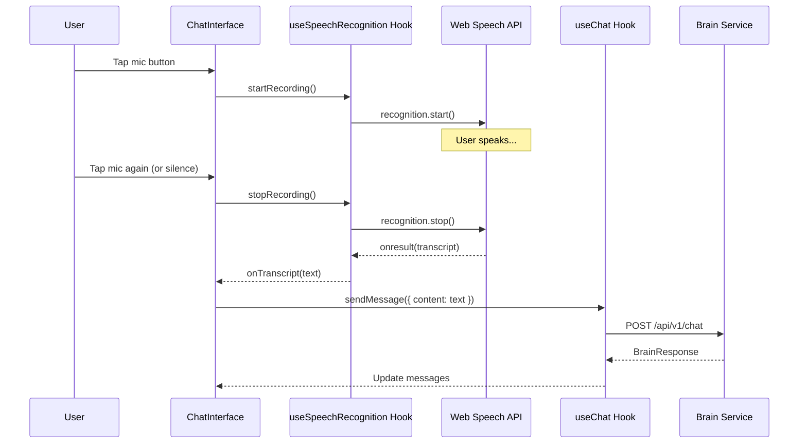

# Design Document: Voice Input

## Overview

This feature adds speech-to-text voice input to the Fitness Copilot chat interface. Users can tap a microphone button to speak their food or exercise logs instead of typing. The transcribed text flows through the existing Brain service, ensuring consistent behavior between voice and text input.

The implementation uses the browser's native Web Speech API (SpeechRecognition), requiring no backend changes. This keeps the feature lightweight and leverages existing infrastructure.

## Architecture

### Component Interaction



### Key Design Decisions

1. **Browser-native STT**: Use Web Speech API instead of external services (Whisper, Google Cloud Speech). This avoids API costs, latency, and backend complexity.

2. **Same message flow**: Transcribed text goes through `sendMessage()` exactly like typed text. No special handling needed in the Brain service.

3. **Custom hook**: Encapsulate speech recognition logic in `useSpeechRecognition` hook for reusability and testability.

4. **Graceful degradation**: If Web Speech API is unsupported (Firefox, some mobile browsers), show a friendly message instead of breaking.

## Components and Interfaces

### useSpeechRecognition Hook

```typescript
interface UseSpeechRecognitionOptions {
  onTranscript: (text: string) => void
  onError?: (error: string) => void
  language?: string // default: 'en-US'
}

interface UseSpeechRecognitionReturn {
  isRecording: boolean
  isSupported: boolean
  startRecording: () => void
  stopRecording: () => void
  error: string | null
}

function useSpeechRecognition(options: UseSpeechRecognitionOptions): UseSpeechRecognitionReturn
```

### ChatInterface Updates

The existing ChatInterface component will be updated to:
1. Replace the placeholder recording logic with the real `useSpeechRecognition` hook
2. Handle the `onTranscript` callback to send messages
3. Show appropriate UI states (recording, error, unsupported)

## Data Models

No new data models required. Voice input produces the same `ChatMessageCreate` payload as text input:

```typescript
{
  content: string,        // Transcribed text
  attachment_type: "none" // No attachment for voice (text only)
}
```

## Correctness Properties

*A property is a characteristic or behavior that should hold true across all valid executions of a system-essentially, a formal statement about what the system should do. Properties serve as the bridge between human-readable specifications and machine-verifiable correctness guarantees.*

### Property 1: Recording state reflects UI

*For any* user interaction with the microphone button, when recording starts the UI SHALL display recording indicators (red color, pulsing), and when recording stops the UI SHALL return to normal state.

**Validates: Requirements 1.1, 1.5**

### Property 2: Transcription triggers on stop

*For any* recording session, when the user stops recording (tap or silence), the Web Speech API SHALL be stopped and any accumulated transcript SHALL be returned via the onTranscript callback.

**Validates: Requirements 1.2**

### Property 3: Voice input uses same message flow as text

*For any* transcribed text from voice input, the system SHALL call sendMessage with the same parameters as if the user had typed that text manually. The Brain service response format SHALL be identical.

**Validates: Requirements 1.3, 2.1, 2.2, 2.3**

### Property 4: Unsupported browser shows error

*For any* browser that does not support the Web Speech API, the system SHALL set isSupported to false and SHALL NOT attempt to start recording.

**Validates: Requirements 1.4**

## Error Handling

| Scenario | Handling |
|----------|----------|
| Browser doesn't support Web Speech API | `isSupported = false`, mic button shows tooltip "Voice not supported" |
| Microphone permission denied | Show error toast: "Microphone access denied" |
| No speech detected | Show error toast: "No speech detected, try again" |
| Network error (STT service) | Show error toast: "Voice recognition failed" |
| Recognition aborted | Silent fail, reset to idle state |

## Testing Strategy

### Unit Tests

- Test `useSpeechRecognition` hook with mocked SpeechRecognition API
- Test ChatInterface renders correct UI states (idle, recording, error)
- Test that unsupported browsers show appropriate fallback

### Property-Based Tests

Using fast-check for property-based testing:

1. **Property 1**: Generate random sequences of start/stop recording calls, verify UI state always matches recording state
2. **Property 3**: Generate random transcript strings, verify sendMessage is called with correct parameters

### Integration Tests

- E2E test with real browser (Chrome) to verify actual speech recognition works
- Manual testing on mobile devices (iOS Safari, Android Chrome)

## Browser Compatibility

| Browser | Support |
|---------|---------|
| Chrome (desktop/Android) | ✅ Full support |
| Safari (iOS/macOS) | ✅ Full support |
| Edge | ✅ Full support |
| Firefox | ❌ Not supported (show fallback) |
| Samsung Internet | ✅ Full support |

