# Fitness Copilot Architecture

This document explains the architecture of the Fitness Copilot application: how the frontend, backend, domain model, and AI services fit together into a coherent system.

---

## High-Level Architecture

At a high level, Fitness Copilot is organized into four logical areas:

- **Clients** - mobile-first web app used by end users, plus potential future external clients.
- **API layer** - a thin HTTP layer that exposes versioned REST endpoints.
- **Application / service layer** - orchestrates use cases such as onboarding, logging, summaries, chat handling, and vision flows.
- **Domain & data layer** - the fitness and nutrition model (users, plans, logs, chat history) stored in a relational database.
- **AI services layer** - Gemini LLM/vision capabilities used by chat and vision services.

### System Overview

The rest of this document explains each area and how data flows through the system.

---

## Clients

### Mobile Web App

The primary client is a mobile-first single-page application that exposes:

- **Monitor view** - daily progress gauges, meal logs, and exercise logs.
- **Workout view** - current training routine and adherence.
- **Nutrition view** - meal plans, logged meals, and remaining targets.
- **Chat view** - conversation with the fitness assistant, including image attachments.
- **Profile view** - basic profile information, theme, and reset/logout actions.

This client:

- communicates exclusively over HTTPS with JSON payloads,
- stores a short-lived access token for authenticated requests,
- reacts to backend state changes (e.g., logs created via chat) by refetching or invalidating cached queries.

### External Clients (future-facing)

The architecture allows for additional clients in the future (native apps, partner integrations, command-line tools) by:

- keeping the API layer stateless and documented by OpenAPI,
- separating presentation concerns from domain and persistence concerns,
- treating the current web app as "just another client" of the HTTP API.

---

## Application / Service Layer

The application layer contains the core services that implement Fitness Copilot's use cases.

### Monitor & Summary Service

Responsibilities:

- Load training programs, routines, and meal plans for the current (or simulated) day.
- Load today's meal and exercise logs.
- Compute daily metrics:
  - calories consumed and remaining,
  - protein consumed and remaining,
  - number of workouts completed.
- Provide this data to:
  - the Monitor view,
  - the chat assistant (for contextual responses),
  - vision flows (for goal-aware advice).

This service treats the domain model as the single source of truth and never talks to AI services directly.

### Chat Brain Service

The Brain is responsible for interpreting chat messages and proposing structured actions. It:

- receives:
  - free-form text,
  - optional attachment metadata,
  - user and context identifiers.
- applies a two-tier approach:
  - **Tier 1** - deterministic parsing:
    - food keyword detection and simple macros lookup,
    - exercise keyword detection and pattern extraction for sets/reps/weight,
    - reset command handling.
  - **Tier 2** - AI-assisted flows:
    - LLM-based exercise extraction for natural language,
    - vision analysis for gym equipment and food photos.
- returns:
  - assistant message text,
  - an action type (log food, log exercise, reset, or none),
  - structured action data used to create logs.

Crucially, the Brain **does not write to the database**. It suggests actions that the application layer applies under validation, guaranteeing that all changes to the Monitor backbone follow the same rules regardless of whether they came from chat or manual inputs.

### Vision Orchestrator

The vision orchestration component:

- accepts image identifiers and user identifiers from the API layer,
- builds a **user context** including:
  - profile (goal, weight, height, activity),
  - actual daily progress (logs),
  - today's plan (scheduled meals and exercises),
  - allowed exercises and relevant chat history,
- calls the AI services layer to:
  - classify images as gym equipment or food,
  - produce structured analyses for gym machines or food plates,
- **validates exercises against today's plan** before proposing actions,
- converts these analyses into proposed logging actions and rich assistant messages.

### Demo Persona / Onboarding Service

This service supports a smooth demo experience:

- Creates or reuses preconfigured personas for common goals (cut, bulk, maintain).
- Seeds:
  - baseline profile attributes (weight, height, activity level, goal),
  - a training program and routines,
  - weekly meal plans.
- Drives the onboarding flow:
  - pre-fills an onboarding form with persona data,
  - persists updates when the user confirms,
  - toggles the onboarding flag so the main app is shown thereafter.

---

## Domain & Data Layer

The domain layer models the core fitness and nutrition concepts; the data layer persists them in a relational database. Together, they provide the "Monitor backbone."

Key aggregates and entities include:

- **User and profile**
  - identity and authentication details,
  - physical attributes (sex, age, height, weight, body fat),
  - goal method (various cut/gain settings or maintenance),
  - activity level,
  - selected training program,
  - protein and fat per-kg settings,
  - onboarding completion flag and simulated day.

- **Training programs and routines**
  - programs define an overall structure (name, description, days per week, difficulty),
  - routines define exercises per day (exercise name, machine hints, sets, reps, target load),
  - designed to be loaded from CSV so they remain easy to inspect and modify.

- **Meal plans**
  - weekly plans mapped to days of week,
  - each entry includes meal type (breakfast, lunch, dinner, snack), item name, calories, and macros.

- **Meal and exercise logs**
  - meal logs capture what was actually eaten (name, type, macros, simulated day, timestamp),
  - exercise logs capture what was actually performed (exercise, sets, reps, weight, simulated day, timestamp).

- **Chat messages and attachments**
  - chat messages store conversational history, actions, and attachment metadata,
  - attachments store binary image data linked back to users and messages.

The data layer enforces:

- non-negative constraints on calorie and macro values,
- sensible ranges for weight, height, and body fat,
- referential integrity between users, programs, routines, plans, logs, and chat history.

---

## AI Services Layer

The AI services layer wraps calls to Gemini and keeps them at the edges of the system:

- **Configuration**
  - LLM usage can be toggled on or off via configuration,
  - the model name and API key are provided externally,
  - when disabled, deterministic fallbacks are used so the app remains functional.

- **LLM interface**
  - a provider abstraction accepts:
    - text prompts for exercise extraction,
    - multimodal prompts for vision,
    - structured user context (profile, plan, progress).
  - returns:
    - structured analyses for gym equipment and food,
    - coaching text aligned with the user's goal and current progress,
    - error or fallback messages when analysis is not possible.

The architecture ensures:

- AI does not directly mutate state,
- all mutations flow through explicit actions and the domain model,
- AI is an enhancement rather than a dependency for core functionality.

---

## End-to-End Flows

### Chat Message Flow (Text)

When a user sends a text message like "I did bench press", the system processes it through multiple layers:

```mermaid
sequenceDiagram
    participant User
    participant API as API Route
    participant Brain as Brain Service
    participant Context as Context Builder
    participant Prompts as Prompts Module
    participant LLM as Gemini LLM
    participant DB as Database

    User->>API: "I did bench press"
    API->>Brain: process_message_async(content, user_id)
    
    Note over Brain: Check for exercise keywords
    Brain->>Context: build_context(user_id)
    Context->>DB: Get user profile, logs, plans
    DB-->>Context: UserContext
    Context-->>Brain: UserContext with scheduled_exercises
    
    Brain->>Prompts: build_exercise_extraction_prompt(ctx)
    Prompts-->>Brain: Formatted prompt with today's exercises
    
    Brain->>LLM: generate(prompt)
    LLM-->>Brain: JSON {exercise_name, sets, reps, weight_kg}
    
    Note over Brain: Validate: Is exercise in today's plan?
    
    alt Exercise in today's plan
        Brain-->>API: BrainResponse(LOG_EXERCISE, action_data)
        API->>DB: Create ExerciseLog
        API-->>User: "💪 Logged Bench Press: 1x10"
    else Exercise NOT in today's plan
        Brain-->>API: BrainResponse(NONE, error_message)
        API-->>User: "❌ Bench Press is not in today's plan"
    end
```

**Key validation points:**
- Exercise must be in today's scheduled exercises to be logged
- If it's a rest day, no exercises can be logged
- The LLM extracts the exercise name, but the Brain validates against the plan

### Vision Flow (Image)

When a user uploads a gym equipment or food photo:

```mermaid
sequenceDiagram
    participant User
    participant API as API Route
    participant Brain as Brain Service
    participant Vision as Vision Service
    participant Context as Context Builder
    participant LLM as Gemini Vision
    participant DB as Database

    User->>API: [IMAGE] + optional text
    API->>Brain: process_message_async(image_base64, user_id)
    
    Brain->>Context: build_context(user_id)
    Context->>DB: Get user profile, logs, plans
    DB-->>Context: UserContext
    Context-->>Brain: Full context
    
    Brain->>Vision: analyze_image(image, context)
    
    Note over Vision: Step 1: Classify image
    Vision->>LLM: "Is this gym_equipment or food?"
    LLM-->>Vision: "gym_equipment"
    
    Note over Vision: Step 2: Analyze with context
    Vision->>LLM: Image + today's exercises + user goal
    LLM-->>Vision: JSON {exercise_name, sets, reps, form_cues}
    
    Note over Vision: Validate: Is exercise in today's plan?
    
    alt Exercise in today's plan
        Vision-->>Brain: GymEquipmentAnalysis
        Brain-->>API: BrainResponse(PROPOSE_EXERCISE, action_data)
        API-->>User: Card with "Add to Track" button
        
        User->>API: Click "Add to Track"
        API->>DB: Create ExerciseLog
        API-->>User: "Tracked ✓"
    else Exercise NOT in today's plan
        Vision-->>Brain: None (rejected)
        Brain-->>API: BrainResponse(NONE, error_message)
        API-->>User: "❌ This exercise is not in today's plan"
    end
```

**Key differences from text flow:**
- Vision returns `PROPOSE_*` action types (preview before tracking)
- User must confirm with "Add to Track" button
- Form tips are available on-demand via "Show Form Tips"

### Context Building

The Context Builder gathers all relevant data for personalized AI responses:

The `UserContext` dataclass contains:
- **User Profile**: goal_method, weight_kg, height_cm, activity_level, sex
- **Today's Progress**: calories_consumed, protein_consumed, workouts_completed
- **Today's Plan**: scheduled_meals, scheduled_exercises
- **Completed Logs**: completed_exercises (with sets/reps/weight details)
- **Allowed Exercises**: all exercises from the user's training program
- **Chat History**: last 10 messages (text only, no attachments)

### Prompt Architecture

Prompts are centralized in `backend/app/services/prompts.py`:

| Prompt | Used By | Context Included |
|--------|---------|------------------|
| `build_exercise_extraction_prompt` | Brain (text) | scheduled_exercises only |
| `build_system_prompt` | Brain (general chat) | Full UserContext |
| `_build_system_context` | Vision | Full UserContext |

This separation ensures:
- Exercise extraction is focused (only needs today's exercises)
- General responses have full context for personalized advice
- Vision has context for goal-specific recommendations

---

## Architecture Principles

Across all flows, the architecture preserves clean separation:

- **Client** handles UX and interaction
- **API layer** validates and delegates
- **Application layer** orchestrates behavior and interprets AI suggestions
- **Domain & data layer** defines and enforces truth
- **AI services** propose actions but never bypass the domain model

Key constraints:
- AI does not directly mutate state
- All mutations flow through explicit actions and validation
- Exercises must be in today's plan to be logged (both text and vision)
- AI is an enhancement, not a dependency for core functionality
